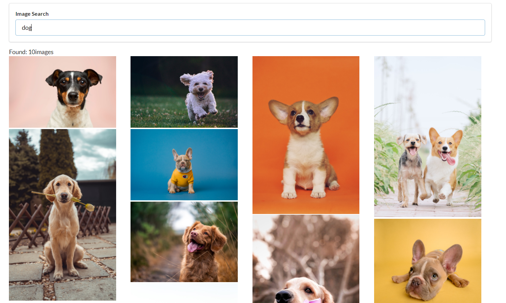

# Image Search
A simple React-App for searching images using `unsplash API`.

The Unsplash API is a modern JSON API that surfaces all of the info you'll need to build any experience for your users.

## How To Run
1. `git clone`
2. `npm install` 
3. `npm start`

### How It Looks

